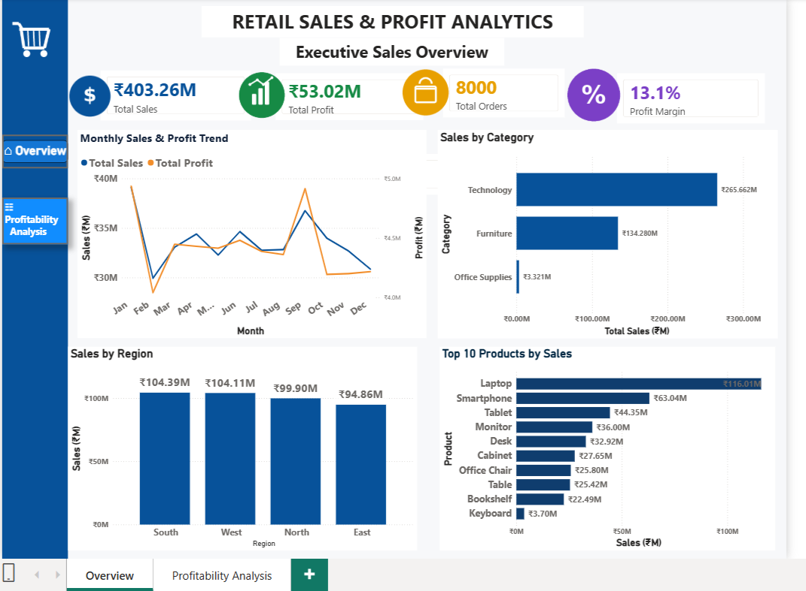
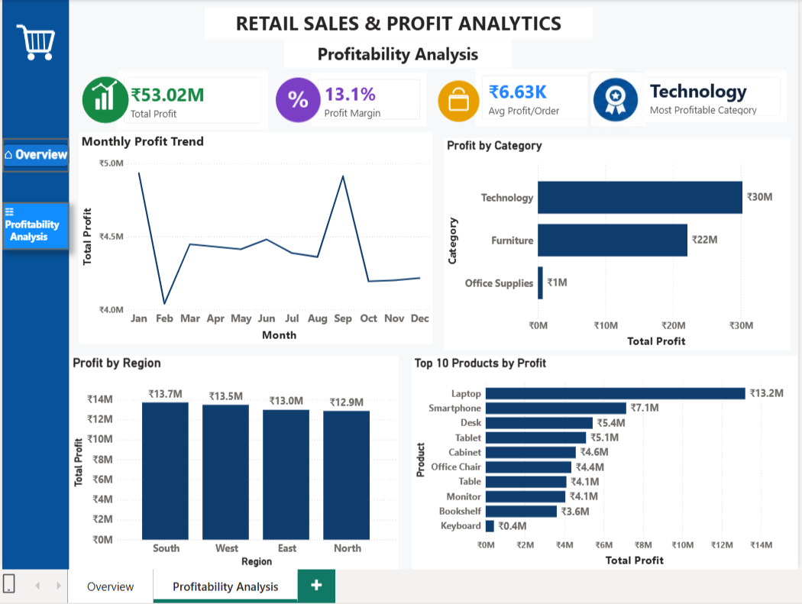

# 📊 Retail Sales & Profit Analytics Dashboard

A portfolio-ready **Data Analytics project** built using **Power BI, Power Query, DAX, Python, Pandas, and GitHub** to analyze retail sales performance, profitability, products, categories, regions, and monthly trends.

---

## 📌 Project Overview

The **Retail Sales & Profit Analytics Dashboard** provides an interactive view of business performance using retail transaction data.

The project focuses on transforming raw sales data into meaningful business insights through:

- Data cleaning and transformation
- Exploratory data analysis
- DAX-based KPI calculations
- Interactive Power BI dashboards
- Product and category analysis
- Regional performance analysis
- Monthly sales and profit trends
- Profitability analysis

---

## 🎯 Project Objectives

The main objectives of this project are to:

- Analyze overall sales and profit performance
- Track total orders and profit margin
- Identify the most profitable categories
- Compare regional sales and profitability
- Identify top-performing products
- Analyze monthly sales and profit trends
- Provide a clear and interactive business intelligence dashboard

---

# 🖥️ Power BI Dashboard

The dashboard contains **two analytical pages**.

## 1️⃣ Executive Sales Overview

The Executive Sales Overview provides a high-level summary of business performance.

### Key KPIs

- 💰 **Total Sales:** ₹403.26M
- 📈 **Total Profit:** ₹53.02M
- 🛒 **Total Orders:** 8,000
- 📊 **Profit Margin:** 13.1%

### Visualizations

- Monthly Sales & Profit Trend
- Sales by Category
- Sales by Region
- Top 10 Products by Sales

---

## 2️⃣ Profitability Analysis

The Profitability Analysis page focuses specifically on profit performance.

### Key KPIs

- 💰 **Total Profit:** ₹53.02M
- 📊 **Profit Margin:** 13.1%
- 💵 **Average Profit per Order:** ₹6.63K
- 🏆 **Most Profitable Category:** Technology

### Visualizations

- Monthly Profit Trend
- Profit by Category
- Profit by Region
- Top 10 Products by Profit

---

## 📸 Dashboard Preview

### Executive Sales Overview


### Profitability Analysis


---

# 🔍 Key Business Insights

Based on the analysis:

- **Technology** is the highest-performing category by sales and profitability.
- **Laptop** is the top product by sales and profit.
- **South** is the highest-sales region.
- The business generates approximately **₹53.02M in total profit**.
- The overall **profit margin is approximately 13.1%**.
- Monthly analysis helps identify fluctuations in sales and profitability throughout the year.
- Product-level analysis highlights the products contributing most to overall revenue and profit.

---

# 🛠️ Tools & Technologies

### Data Analysis
- Python
- Pandas

### Business Intelligence
- Microsoft Power BI
- Power Query
- DAX

### Data & Version Control
- CSV
- GitHub

---

# 🧹 Data Preparation

The raw retail transaction dataset was cleaned and transformed before visualization.

### Data preparation included:

- Handling and validating data types
- Checking missing values
- Preparing date-related fields
- Creating a dedicated Date Table
- Creating calculated measures using DAX
- Validating calculated KPIs against the source dataset

---

# 📐 DAX Measures

Key DAX measures were created for business analysis, including:

```DAX
Total Sales
Total Profit
Total Orders
Profit Margin
Average Profit per Order

 
## 📌Conclusion 

The Retail Sales & Profit Analytics Dashboard demonstrates an end-to-end data analytics workflow, from raw data preparation and exploratory analysis to interactive Power BI visualization and business insight generation.

This project showcases practical Data Analyst skills using Python, Pandas, Power BI, Power Query, DAX, and GitHub and is designed as a portfolio project for demonstrating real-world analytics capabilities

